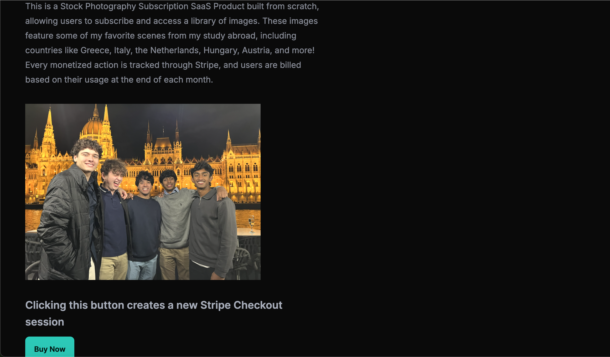
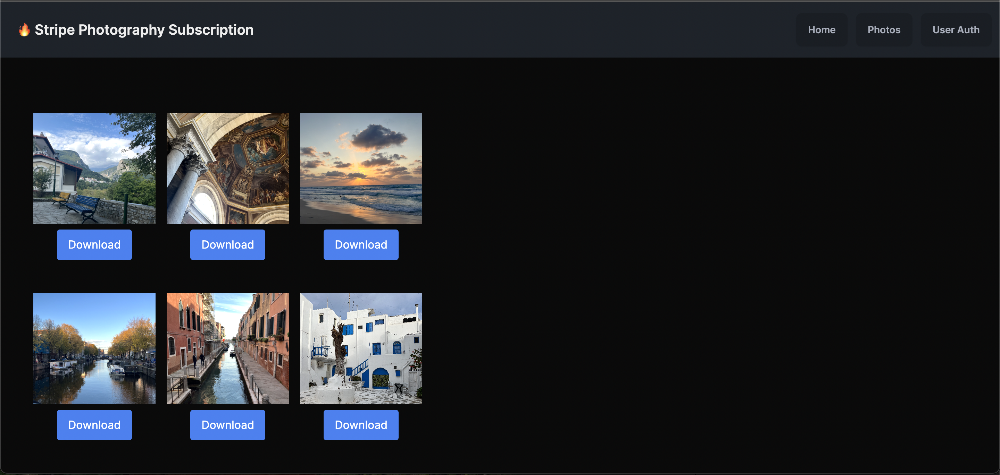
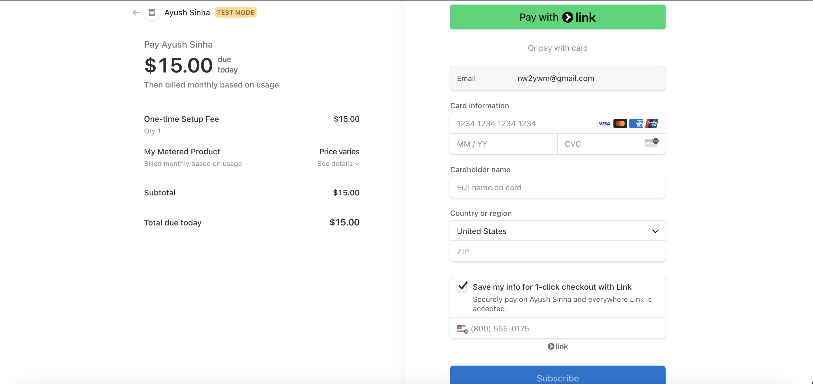
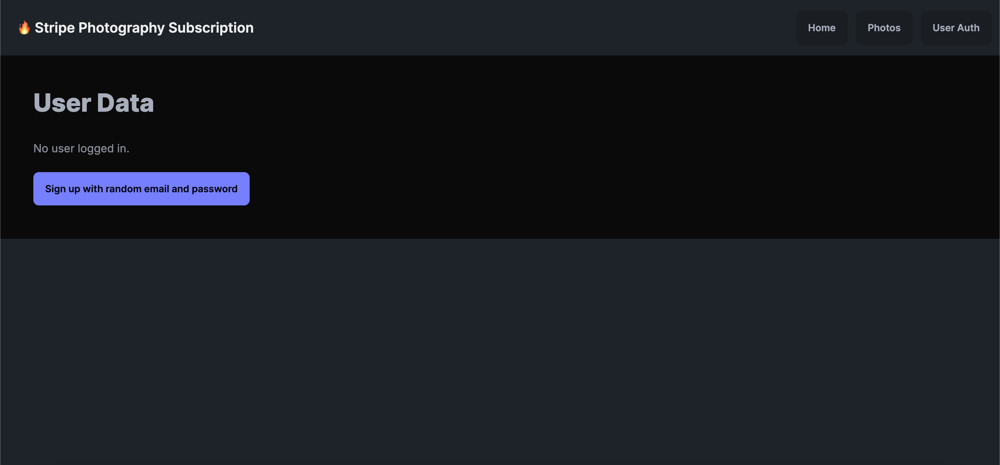

# Subscription-Based Photography SAAS Platform 📷 | https://stripe-photography-subscription.vercel.app/
## Description
This subscription-based photography SaaS platform is built with Next.js, React, Stripe, and Supabase to manage user authentication, subscriptions, and payments. Users must purchase a subscription plan to access a curated library of images, all captured from scenes I experienced during my study abroad in Greece, Italy, the Netherlands, Hungary, Austria, and more. Stripe Checkout and Payment Intents handle secure transactions, allowing users to subscribe, manage, and cancel their plans anytime. Supabase stores user data and subscription statuses, while Next.js API routes process Stripe webhooks to update subscriptions in real-time. The platform leverages Toast notifications to provide real-time feedback for successful payments, subscription updates, and errors. It is deployed on Vercel, utilizing serverless functions for seamless payment processing and account management.

### Note
Stripe offers test cards that are compatable with this project that you can use if you do not want to enter your actual info. Here is the information of a test card:

  Visa: 4242 4242 4242 4242

   CVC: Any 3 digits

   Expiration Date: Any future date

## Pictures

  

  Above is an example home page.

  

  Above is an example photos page.

  

  Above is an example payment page for the subscription.

  

  Above is an example user information page.

## Tech Stack
- 
- 
- 
- 
- 
- Stripe API (https://stripe.com/docs/api)
